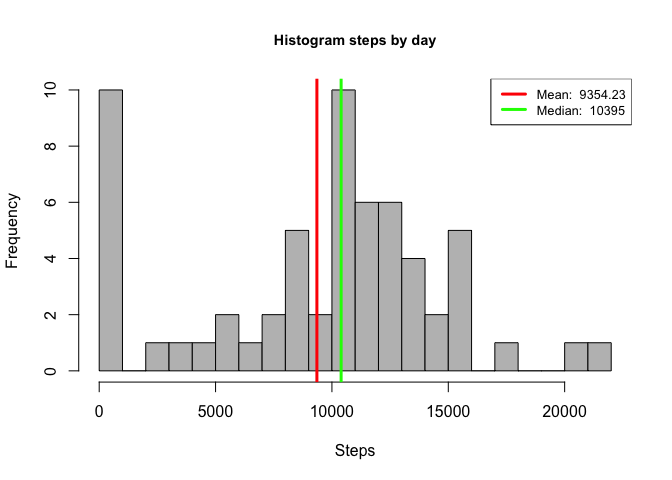
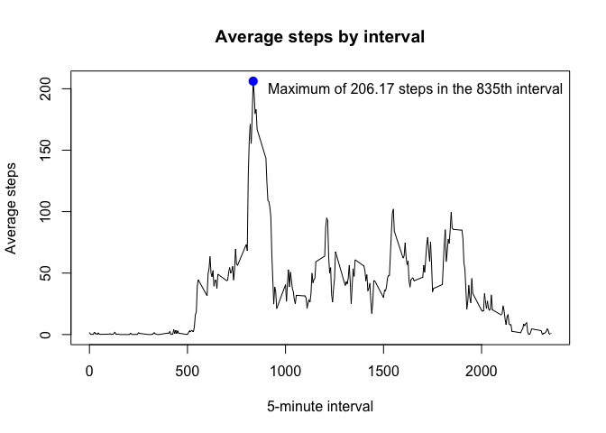
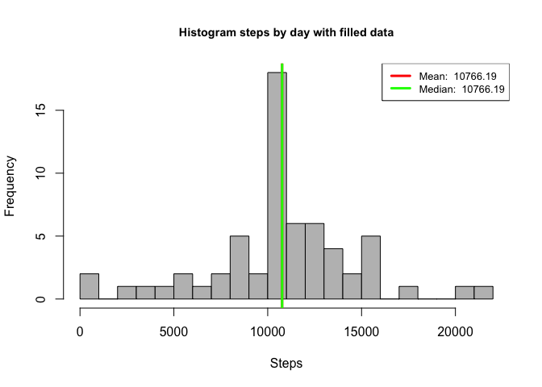
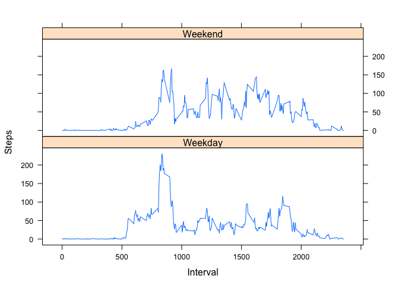

# Reproducible Research: Peer Assessment 1
José Alberto Hernández  


## Loading and preprocessing the data

Input data variables

```r
url_data <- "https://d396qusza40orc.cloudfront.net/repdata%2Fdata%2Factivity.zip"
zip_data <- "activity.zip"
csv_data <- "activity.csv"
```

[Download the zip]("https://d396qusza40orc.cloudfront.net/repdata%2Fdata%2Factivity.zip") file containing activity data, save it to the working directory

```r
download.file(url_data, destfile = zip_data)
```

Unzip the zip file to get the csv file

```r
unzip(zip_data)
```

Read the activity data from the csv file considering:

- (,) Comma as delimiter
- (") Quote as quote indicator
- NA string as missing values


```r
data <- read.csv(csv_data, sep = ",", quote = "\"", na.strings = "NA")
```

Exploring the raw data

```r
str(data)
```

```
## 'data.frame':	17568 obs. of  3 variables:
##  $ steps   : int  NA NA NA NA NA NA NA NA NA NA ...
##  $ date    : Factor w/ 61 levels "2012-10-01","2012-10-02",..: 1 1 1 1 1 1 1 1 1 1 ...
##  $ interval: int  0 5 10 15 20 25 30 35 40 45 ...
```

We can see

- 17,568 observations
- 3 variables steps, date, interval
- The date variable is factor class
- There are missing values (NA) in the steps variable


```r
summary(data)
```

```
##      steps                date          interval     
##  Min.   :  0.00   2012-10-01:  288   Min.   :   0.0  
##  1st Qu.:  0.00   2012-10-02:  288   1st Qu.: 588.8  
##  Median :  0.00   2012-10-03:  288   Median :1177.5  
##  Mean   : 37.38   2012-10-04:  288   Mean   :1177.5  
##  3rd Qu.: 12.00   2012-10-05:  288   3rd Qu.:1766.2  
##  Max.   :806.00   2012-10-06:  288   Max.   :2355.0  
##  NA's   :2304     (Other)   :15840
```
There are 2,304 NA's


```r
head(data)
```

```
##   steps       date interval
## 1    NA 2012-10-01        0
## 2    NA 2012-10-01        5
## 3    NA 2012-10-01       10
## 4    NA 2012-10-01       15
## 5    NA 2012-10-01       20
## 6    NA 2012-10-01       25
```

Cleaning the raw data, setting the date as Date with the format YYYY-MM-DD

```r
# Convert the date variable to Date type 
data$date <- as.Date(as.character(data$date), "%Y-%m-%d")
str(data)
```

```
## 'data.frame':	17568 obs. of  3 variables:
##  $ steps   : int  NA NA NA NA NA NA NA NA NA NA ...
##  $ date    : Date, format: "2012-10-01" "2012-10-01" ...
##  $ interval: int  0 5 10 15 20 25 30 35 40 45 ...
```
Now, the date variable is Date class

## What is mean total number of steps taken per day?
Calculate the total number of steps taken per day without missing values

```r
# Calculate the total number of steps by day without missing values
total.steps <- tapply(data$steps, data$date, FUN = sum, na.rm = TRUE)
```

Plot (Histogram) of the total number of steps walked each day

```r
# Create the Histogram to view the steps by day with filled data
hist(total.steps, xlab = "Steps", main = "Histogram steps by day", 
     breaks = 25, col = 'grey', cex.main = 0.9)

# mean and median values round with 2 decimals
total.steps.mean = round(mean(total.steps, na.rm = TRUE), 2)
total.steps.median = round(median(total.steps, na.rm = TRUE), 2)

# Print the mean and median lines
abline(v = total.steps.mean, lwd = 3, col = 'red')
abline(v = total.steps.median, lwd = 3, col = 'green')

# Print the legend with the mean and median values
legend('topright', lty = 1, lwd = 3, col = c("red", "green"), cex = .8, 
               legend = c(paste('Mean: ', total.steps.mean),
               paste('Median: ', total.steps.median)))
```



*mean* and *median* functions without missing values

```r
mean(total.steps, na.rm = TRUE)
```

```
## [1] 9354.23
```

```r
median(total.steps, na.rm = TRUE)
```

```
## [1] 10395
```
The *mean* is 9,354.23 and the *median* is 10,395

## What is the average daily activity pattern?
Agregate the data by date without the missing values

```r
# Agregate the dataset to get the mean by interval withou the missing values
average.by.day <- aggregate(x = list(steps = data$steps), 
                      by = list(interval = data$interval), FUN = mean, na.rm = TRUE)
```

Time series plot with

- (x-axis) as the 5-minute interval, and 
- (y-axis) as the average number of steps taken, averaged across all days


```r
# Plot the time series
with(average.by.day, {
        plot(interval, steps, type = 'l',
             main = 'Average steps by interval',
             xlab = '5-minute interval', ylab = 'Average steps')
        })

# Find the maximum of step and interval
maximum = average.by.day[which.max(average.by.day$steps), ]

# The string label for the maximum of step and interval
max_lab = paste('Maximum of ', round(maximum$steps, 2), ' steps in the ', maximum$interval, 'th interval', sep = '')

# Print the point with the maximum of steps and interval
points(maximum$interval, maximum$steps, col = 'blue', lwd = 3, pch = 19)

# Print the label with the maximum number of steps and interval
legend("topright", legend = max_lab, bty = 'n')
```



#### Which is tne maximum number of steps in the 5-minute interval?

```r
average.by.day[which.max(average.by.day$steps), ]
```

```
##     interval    steps
## 104      835 206.1698
```
> Maximum of 206.17 steps in the 835th interval 

## Imputing missing values
As we saw with the *summary* function, we have 2,304 observations with missing values (coded as NA). The presence of missing values may introduce bias into some calculations or summaries of the data.

```r
sum(is.na(data$steps))
```

```
## [1] 2304
```

Function for set the *mean* value of 5 minute interval where there are missing values

```r
fill.value <- function(steps, interval) {
  filled <- NA
  if (!is.na(steps)) 
    filled <- c(steps) 
  else 
    filled <- (average.by.day[average.by.day$interval == interval, "steps"])
  return(filled)
}
```

Replacing each of these 2,304 missing values, with the *mean* value of its 5 minute interval

```r
filled.data <- data
filled.data$steps <- mapply(fill.value, filled.data$steps, filled.data$interval)
```

Validate there is not more missing values in the *filled.data* dataset

```r
sum(is.na(filled.data$steps))
```

```
## [1] 0
```
Now, there are 0 NA's in the *filled.data* dataset

Calculate the total number of steps taken per day with all the observations

```r
total.steps <- tapply(filled.data$steps, filled.data$date, FUN = sum)
```

Plot (Histogram) of the total number of steps taken each day, with all the observations

```r
# Create the Histogram to view the steps by day with filled data 
hist(total.steps, xlab = "Steps", main = "Histogram steps by day with filled data", 
     breaks = 25, col = 'grey', cex.main = 0.9)

# mean and median values round with 2 decimals
total.steps.mean = round(mean(total.steps), 2)
total.steps.median = round(median(total.steps), 2)

# Print the mean and median lines
abline(v = total.steps.mean, lwd = 3, col = 'red')
abline(v = total.steps.median, lwd = 3, col = 'green')

# Print the legend with the mean and median values
legend('topright', lty = 1, lwd = 3, col = c("red", "green"), cex = .8, 
               legend = c(paste('Mean: ', total.steps.mean),
               paste('Median: ', total.steps.median)))
```



*mean* and *median* functions with all the observations

```r
mean(total.steps)
```

```
## [1] 10766.19
```

```r
median(total.steps)
```

```
## [1] 10766.19
```
The *mean* and *median* are equal to 10,766.19 

## Are there differences in activity patterns between weekdays and weekends?

Function for getting the day type (weekday / weekend) based in the date value passed as parameter

```r
weekday.or.weekend <- function(dayname) {
  if (dayname %in% c("Saturday", "Sunday")) {
    return("Weekend") 
  }
  return("Weekday") 
}
```

Set the day variable with the *weekday.or.weekend* function

```r
# Set the dayname variable to set: day of week
filled.data$dayname = weekdays(filled.data$date)

# Add daytype variable to set: Weekday or Weekend
filled.data$daytype = as.factor(apply(as.matrix(filled.data$dayname), 1, weekday.or.weekend))
```
Now we have 5 variables steps, date, interval, dayname, daytype in the *filled.data* dataset

Agregate the *filled.data* dataset in the steps variable agains the interval and day variables

```r
# Summarize the dataset with the mean grouped by interval and daytype
library(data.table)
summary.by.daytype = data.table(filled.data)[, list(avg_steps = mean(steps)), 
                          by = list(interval, daytype)]
```

Panel plot for comparing the difference in activity patterns between weekday and weekends

```r
library(lattice)
# XY Plot for the relation with the avg_steps and interval variables, splited by daytype variable
xyplot(avg_steps ~ interval | daytype, data = summary.by.daytype,
      type = 'l',
      xlab = 'Interval',
      ylab = 'Steps',
      layout = c(1,2))
```



> **Yes!**, there are differences, the group of enthusiasts walks more in the Weekends, but the group of enthusiasts walks more, early in the morning around 8.00 hrs, in the Weekdays
